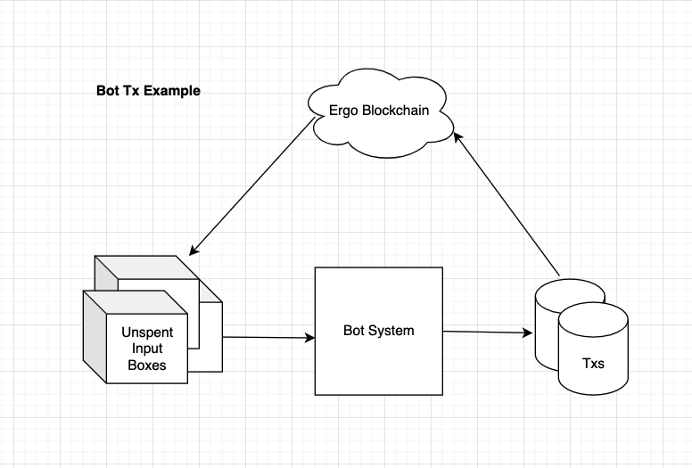
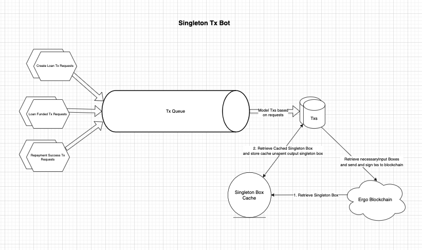

# Exle Tx Bot

```text title="Development Status"
Version: 1st Draft
IsImplemented: false
CurrentStatus: Code Design
```

Within an eUTxO system, the boxes has to be processed in an off-chain manner. These are normally run in a CRON job manner that turns on every block (2 minutes).

Each bot would require the necessary information and instruction to properly process the box and send the correct txs to the blockchain.

As each dApp system is different, each dApp would require it's own bot to run the system and process the transactions. This article explains the architecture of our bot system both for our reference and for Ergo Developers to learn from.

## Input-Output {#inputoutput}
Most systems takes in an Input, runs through a black box and produces an output.

In a tx bot system, it takes in Unspent Input Boxes as inputs, and outputs transactions that are sent to the blockchain for confirmation, which would then proceed to generate outputs that will then be used as Unspent Input Boxes.



## System Architecture
In Exle's On-Chain system, we use a singleton design that exists to distribute tokens to correctly identify lend boxes and repayment boxes. This design though common, can become a bottleneck when it comes to processing transactions. This is because each transaction that involves distribution or absorption of a token requires the singleton box.

To address scalability issues, Exle Bot will utilize Ergo's chained transaction system to chain transactions together when processing transactions.

### Chaining Transactions
To properly chain transactions, we will have to ensure that the transactions are all lined up in a **queue**. This allows us to process each transaction and produce the required output transaction id and output service box as an unspent input box for the next transaction to be chained.

1. First gather all transactions that interacts with the singleton box.
2. Line the transaction requests up in a queue.
3. Cache the Singleton Box Cache by grabbing the singleton Input Box from the Ergo Blockchain.
4. Process the first transaction from the queue with required input boxes retrieved from the Blockchain, alongside the cached singleton box.
5. Sign and send the tx, and retrieve the Singleton Unspent Output Box, and cache it into the Singleton Box Cache.
6. [Optional] Cache the request to keep track of the requests that are processed.
7. Repeat step 4 & 5 till queue is empty.



### Signing Txs
There exist the question of whether we should sign and send the tx in bulk after we finish processing, or do we sign and send right after processing the request.

Both are valid, however it would be simpler if we were to just sign and send the tx right after we process it to avoid tracking errors. 