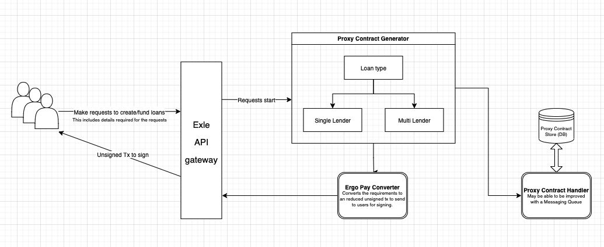

# Proxy Contract Payment System

```text title="Development Status"
IsImplemented: true
CurrentStatus: SLT Integration
```

[Proxy contracts](https://github.com/ergoplatform/eips/blob/master/eip-0017.md) are widely used in the ergo ecosystem. The system helps facilitates and ensures a transaction is performed based on the contract that is written.

Within Exle, proxy contracts are heavily used in the process of funding loans, repayments and also in the creation of loans.

## Integration with ErgoPay
The backend system is designed to integrate proxy contract alongside [ErgoPay](https://www.youtube.com/watch?v=Jb6Amjai0Bc). This heavily improve the user experience as users who connected their wallet with our dApp can send the right amount of payment to the right proxy contract by just clicking sign on the Nautilus dApp. This reduces room for error when sending funds to the proxy contract.

## System Architecture
When a user makes a loan funding/creation request. It calls the backend and use the details to generate a proxy contract. The details, including the proxy contract are then stored in a database.

After that, the details are put into an ErgoPay Converter that generates the bytes of the UnsignedReducedTx and include it alongside other details to be sent to the client.

Exle's client-side would have connected the users wallet to the dApp. The bytes are then sent to the wallet to process and generates a tx that is ready for the user to sign and send the funds over.

The figure below shows the architecture of the Proxy Contract Payment System.


